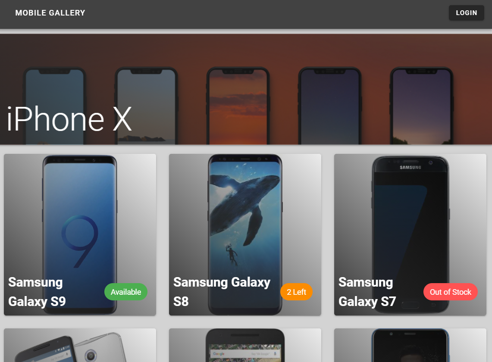
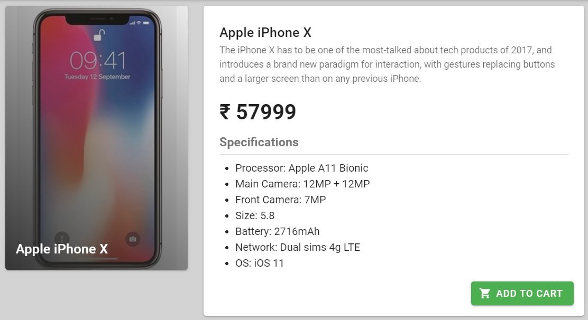
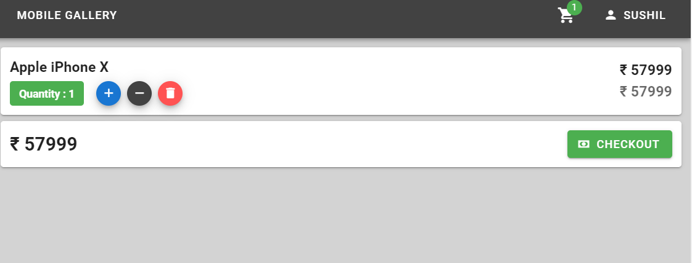
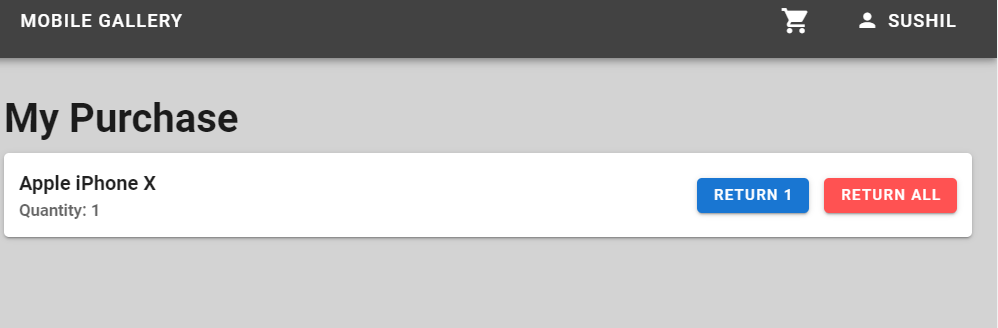
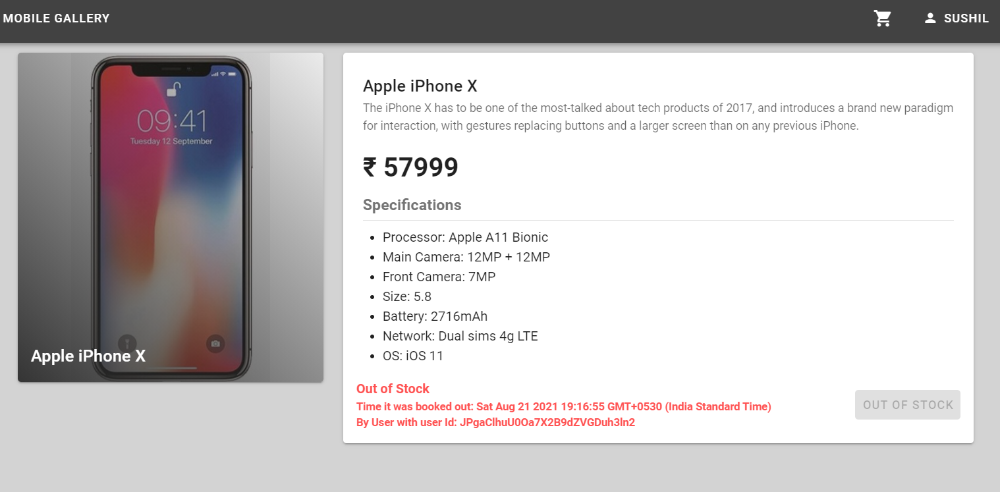
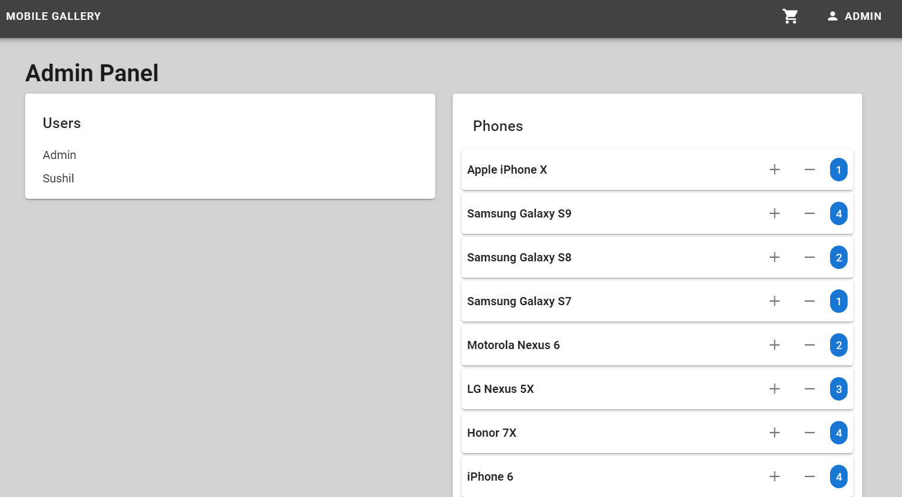

# Mobile Store

## Description
Mobile Gallery is a progressive web app, it is 
basically a dummy mobile store, users can do many 
functions like adding items to the cart, changing
the number of items, placing the order, viewing orders.
Admin can change the stock of mobiles, can also order
of the users. It has got an email/password authentication
system with a forgot password option too. This
web app can be used on mobile/laptop/pc as
it is a progressive web app we can also install it
on our mobile/laptop home screen.

## Features
* Realtime updates
* Firebase Authentication
* Admin Mode
* Simple, Elegant UI
* Cross-Platform

## Tech Stack
* Vue.js, Vuex & Vue-Router
* firebase-auth & firebase-database
* Vuexfire & Vuetify

## Screenshots






## Admin Panel
```
📧 admin@gmail.com
🔑 admin@12345
```
Login with the above details to see the secret Admin Panel
Once you log in via admin credentials.
Click on the Menu Button. You will now see this admin panel.


## Project setup
```
yarn install
```

### Compiles and hot-reloads for development
```
yarn serve
```

### Compiles and minifies for production
```
yarn build
```

### Lints and fixes files
```
yarn lint
```

### Customize configuration
See [Configuration Reference](https://cli.vuejs.org/config/).
